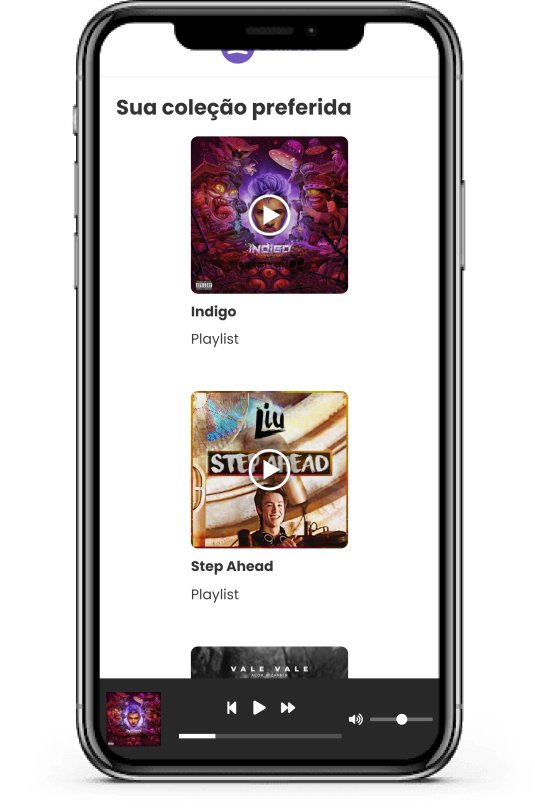

  

# 

###### Este projeto foi desenvolvido durante minhas aulas de Construção de website da faculdade, porém eu acabei gostando da idéia e acabei indo um pouco além para praticar meus conhecimentos de HTML, CSS3 e JS.

*O nome do projeto é GoMusic me baseei em alguns projetos da Rocketseat e também no Spotify e a idéia do projeto é bem simples um site de playlist de músicas.*

[clique aqui para ver o site](https://gomusic.netlify.app/landing.html)

#VanillaJS #Responsive

;

;

;

  
  
  

